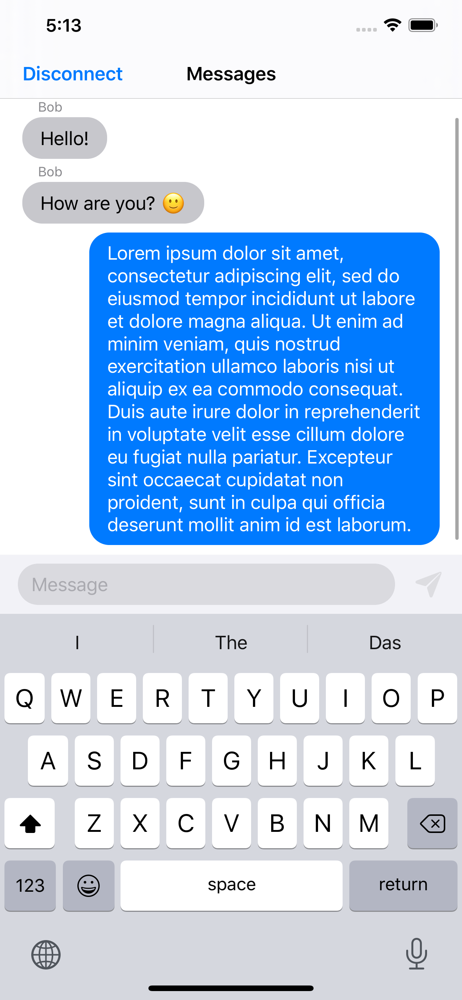

# WebSocket Tryout
Super-simplified messaging iOS application and WebSocket server.

  

### To run the server
* install Node.js
* inside Server folder: `$ node run`

### To run the iOS app
* in file AppEnvironment.swift change address `"ws://192.168.0.3:80"` to your host address.
